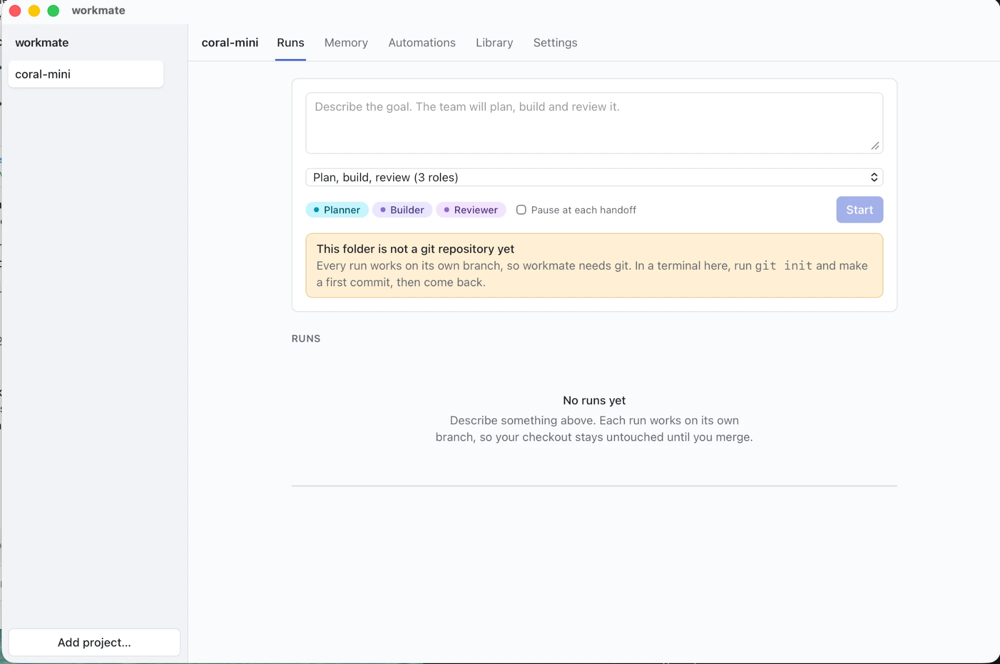
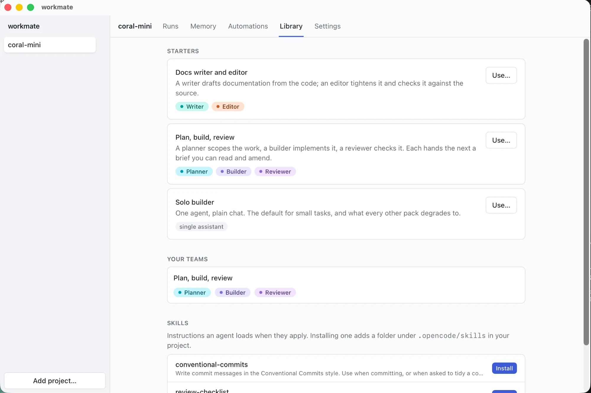
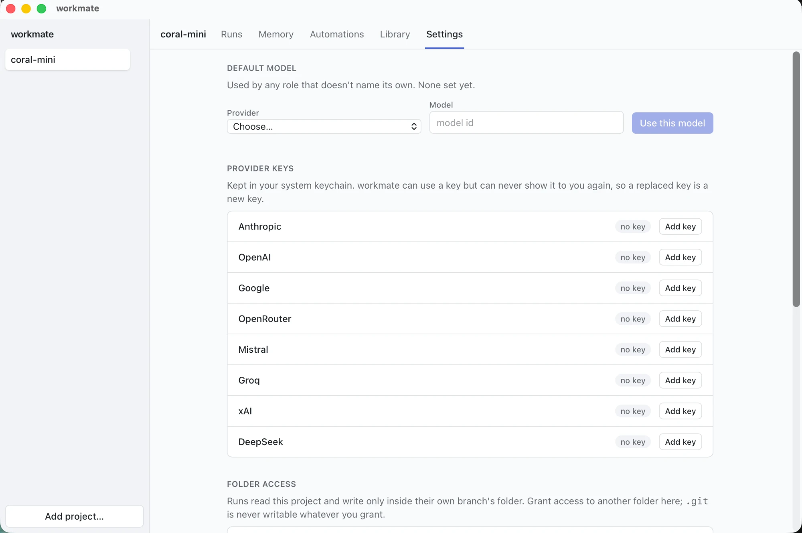

# workmate

**A dev team that remembers your projects and lives in your repo.**

workmate is a local-first AI workspace for macOS. Your work stays on your
machine; the agent engine is bundled, so it runs on first launch.

## Screenshots

<p align="center">
  
</p>

<p align="center"><em>Runs — a team of roles, and a clear reason when something stands in the way.</em></p>

<p align="center">
  
</p>

<p align="center"><em>Library — starters ship a configured team, not just files.</em></p>

<p align="center">
  
</p>

<p align="center"><em>Settings — keys live in your system keychain and are never shown again.</em></p>

## What makes it different

Three things, and they are the reason this exists rather than being another
chat window:

**A collaborating agent team.** Not three models racing the same prompt — a
team of named roles with their own prompt, model and tools, handing one task
between each other. Every handoff is an explicit, inspectable card in the
thread: you can see what one role actually passed to the next, and amend it
before it lands.

**Memory that outlives a workspace.** workmate keeps a store of claims about
your projects — conventions, decisions, preferences — associated with
workspaces rather than owned by them, so removing a folder never deletes what
was learned. Memory is written by an explicit tool call, never mined silently
in the background, and everything it tells an agent is recorded on the turn
that received it.

**Repo-native by construction.** A run works in its **own git worktree** on
its own branch, never your checkout. That is what makes leaving a team running
unattended defensible. The permission surface is derived from git — the
worktree is writable, `.git/` is not — rather than from a folder convention an
agent with a shell can walk straight past.

## Status

Early, but complete end to end: runs, teams and handoffs, memory, MCP servers,
cron automations, starter packs and skills, all behind the app shown above. CI
runs the full gate and a real-engine end-to-end test on Apple silicon, Intel and
Linux. Not yet: a signed release, and Windows. See
[`.wayfinder/map.md`](.wayfinder/map.md) for the route, and the tickets
alongside it for why each decision went the way it did.

## Requirements

- macOS (Apple Silicon or Intel)
- Node 20+, pnpm 11+, [Bun](https://bun.sh) (compiles the sidecar)
- `rustup` and Xcode command line tools (the Rust version is pinned in `rust-toolchain.toml`)

## Getting started

```bash
pnpm install
pnpm sidecar:fetch   # downloads the pinned OpenCode engine into the bundle
pnpm sidecar:build   # compiles the orchestration sidecar beside it
pnpm dev
```

## The gate

Everything must be green before a commit; the pre-commit hook enforces it.

```bash
pnpm gate
```

That runs typecheck, lint and tests across the workspace, the engine-contract
drift check, plus `cargo clippy` and `cargo test` for the Rust shell.
`pnpm test:e2e` additionally drives the real bundled engine against a fake model.

## Layout

| Path | What lives there |
|---|---|
| `packages/core` | The domain model — scopes, memory, runs and handoffs. Pure TypeScript, tested hard. |
| `packages/sidecar` | The Node sidecar: OpenCode client and the team orchestration above it. |
| `apps/desktop` | The Tauri 2 shell and the React 19 front end. |
| `scripts` | Build and release tooling, including the pinned-engine fetch and bundle verification. |
| `docs` | Releasing, and the screenshots above. |
| `.wayfinder` | The map: destination, decisions and their tickets. |

## Licence

MIT — see [LICENSE](LICENSE) and [NOTICE](NOTICE).
